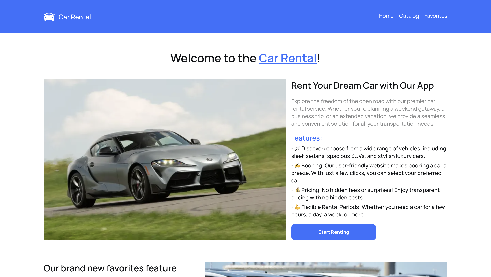
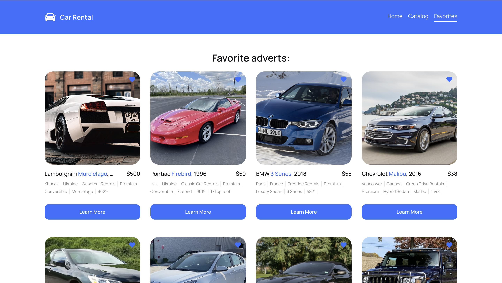

# Car Rental

Welcome to our Car Rental App! This application allows users to easily find and rent a car, making the process quick and hassle-free with the help of customizable search and favorites page

## Features

- **Search and Filter:** Find the perfect car for your needs by searching and applying filters such as model, make, and rental price.

- **Booking System:** Reserve your desired car with our straightforward booking system. Receive confirmation and details via email.

- **Favorites:** Store your most desired cars in on place - personal page, where you can save different cars depending on the situation.
  

## Views
![Home Page]

*The welcoming home page displays main features and innovations.*

*The catalog page shows the list of cars depending on filters.*

![Favorites adverts]

*Discover and save rentals that you have liked the most.*

## Technologies Used

- Frontend: HTML, CSS, React, Redux, React-Router
- Backend: Mockapi.io

## Getting Started

1. Clone the repository: `git clone https://github.com/your-username/car-rental-web-app.git`
2. Navigate to the project directory: `cd car-rental-web-app`
3. Install dependencies: `npm install`
4. Set up environment variables (refer to `.env.example` for required variables).
5. Run the application: `npm start`

Happy renting!
